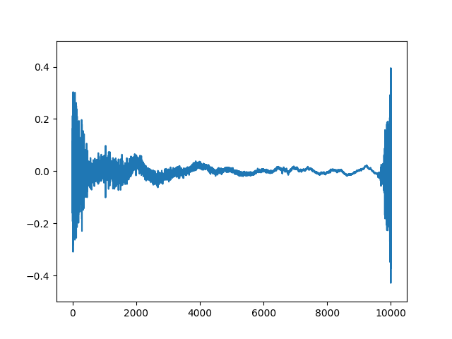

# Gifconverter

A package for simpler converting a set of images into a gif using the imageio package.

***

* [Provides](#provides)
* [What will the function do?](#what-will-the-function-do)
* [Example gif](#example-gif)

***

### Provides

A function `make_gif()` which turns the specified images of an folder into a .gif.

***

### What will the function do?
Given a folder structure as:
```
└───temp
    ├───images
    │   └───img (0).png
    │   └───img (1).png
    │   └───img (2).png
    └───main.py
```
where `main.py` has the function `make_gif("./temp/images", "./temp/my_gif.gif")`. This will generate a file `.gif` going through the images. The final structure will look like:
```
└───temp
    ├───images
    │   └───img (0).png
    │   └───img (1).png
    │   └───img (2).png
    ├───main.py
    └───my_gif.gif
```

***

### Example gif

